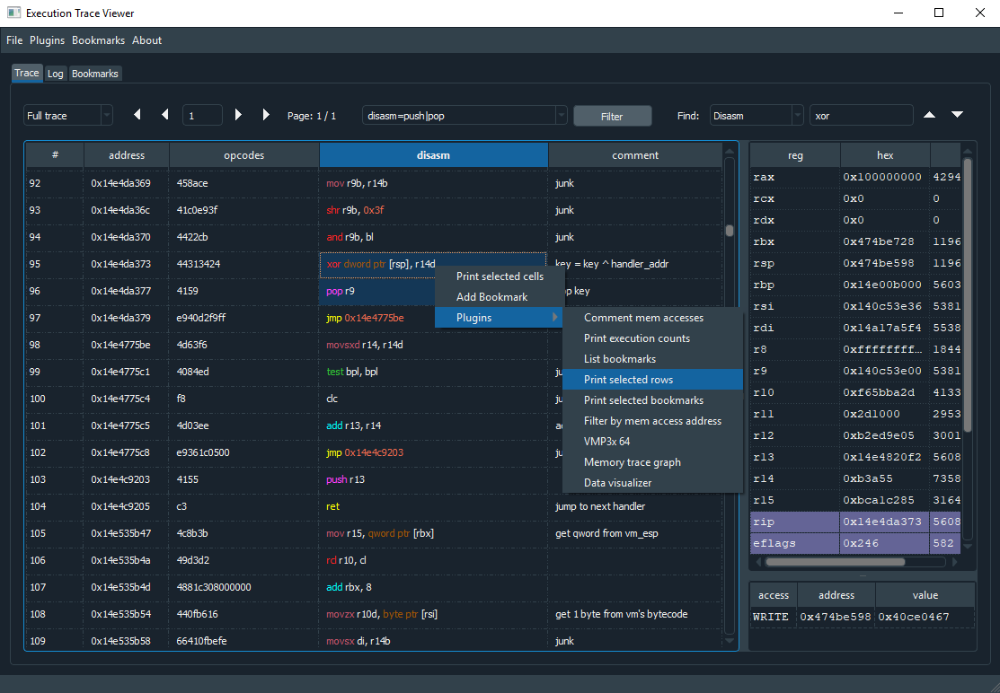

# Execution Trace Viewer

Execution Trace Viewer is an application for viewing, editing and analyzing execution traces. It was originally made for reverse engineering obfuscated code, but it can be used to analyze any kind of execution trace.



## Features

- open, edit and save execution traces
- search & filter trace by disasm, reg values, memory address/value, etc
- add comments and bookmarks
- write python plugins
- supports x64dbg traces

## Dependencies

- [Python 3.6](https://python.org/download)
- [PyQt5](https://www.riverbankcomputing.com/software/pyqt/intro)
- [Yapsy](https://github.com/tibonihoo/yapsy/)
- [QDarkStylesheet](https://github.com/ColinDuquesnoy/QDarkStyleSheet)
- [Capstone](https://github.com/aquynh/capstone)

## Install & run

```shell
pip install pyqt5 yapsy qdarkstyle capstone
python tv.py
```

## Trace file formats

Following file formats are supported:

- .tvt - Default file format. Developed from x64dbg trace format. 3 differences with x64dbg format: comments, disasm and bookmarks added.

- .trace32 / .trace64 - x64dbg file format. Only reading supported. Loading x64dbg traces is slow because the code needs to be disassembled.

- json - Traces can be saved and loaded from json text files.

Traces folder contains one sample trace. It is ~11k lines of obfuscated code (by VMProtect3). All the handlers are disassembled and added to bookmarks.

## Plugins

Execution Trace Viewer can be extended by Python3 plugins. Plugins are launched from plugins menu or from right-click menu on trace table.

Check the example plugins and core/api.py for more info.

## Filters

Example filters:

   Filter                 |    Description
--------------------------|--------------------------------------------------------------
disasm=push&#x7c;pop      |  disasm contains word push or pop (push, pushfd, pop, etc)
reg_eax=0x1337            |  show rows where eax is 0x1337
reg_any=0x1337            |  any reg value is 0x1337
mem_value=0x1337          |  read or write value 0x1337 to memory
mem_read_value=0x1337     |  read value 0x1337 from memory
mem_addr=0x4f20           |  read from or write to memory address 0x4f20
mem_read_addr=0x40400     |  read from memory address 0x40400
mem_write_addr=0x40400    |  write to memory address 0x40400
opcodes=c704              |  filter by opcodes
rows=20-50                |  show only rows 20-50
regex=0x40?00             |  case-sensitive regex search for whole row (including comment)
regex=READ                |  show insctructions which read memory
iregex=junk&#x7c;decrypt  |  inverse regex, rows with 'junk' or 'decrypt' are filtered out

It's possible to join multiple filters together:

```
disasm=xor/reg_any=0x1337 ; show all xor instructions where atleast one register value is 0x1337
```

For more complex filtering you can create a filter plugin and save the result list using api.set_filtered_trace(). Then click the filter checkbox to switch between full and filtered trace.

## Find

Finds next or previous row that contains specified keyword/value in trace.

### Using Find in plugin

Find previous memory write:

```python
from core.filter_and_find import TraceField
current_row = 500
next_row = find(
    trace=trace_data.trace,
    field=TraceField.MEM,
    keyword='WRITE',
    start_row=current_row,
    direction=-1
)
```

Trace fields: DISASM, REGS, MEM, MEM_ADDR, MEM_VALUE, COMMENT, ANY

DISASM field supports multiple keywords: "xor/shl/shr". MEM field checks all three fields in mem access (access, addr and value). Integers must be given in hexadecimal.

## Themes

Dark theme can be disabled by editing prefs.py:

```python
USE_DARK_THEME = False
```

## To-Do

- add support for more trace formats & architectures
- fix x64dbg trace problem: if memory content doesn't change on write operation, the access is shown as 'READ' (bad design of the file format?)
- fix tooltip size (bug in QDarkStylesheet?)
- documentation

## License

MIT

## Author

Execution Trace Viewer was developed by Teemu Laurila.

Contact:

```python
''.join(map(chr,[k^86 for k in [34,51,51,59,35,58,55,22,38,36,57,34,57,56,59,55,63,58,120,53,57,59]]))
```
